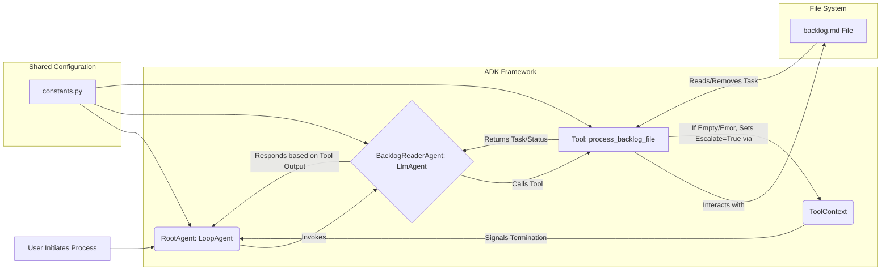

# Project Technical Design: Sleepy Dev Team PoC (ADK Backlog Processor)

## 1. Overview

This document outlines the technical design and architecture of the Sleepy Dev Team Proof of Concept (PoC). This system is built using the Google Agent Development Kit (ADK) in Python. Its core function is to automatically process tasks listed in a text-based backlog file (`backlog.md`) one by one. The system uses a hierarchical agent structure, where a root agent manages the overall workflow and a sub-agent interacts with a tool to read and remove tasks from the backlog file until it is empty. The primary goal is to demonstrate a basic loop for task consumption from an external source using ADK agents and tools.

## 2. System Architecture

The system consists of the following main components:

*   **Google Agent Development Kit (ADK)**: The underlying framework used to build the agent system.
*   **Root Agent (`SleepyDev_RootAgent_PoC`)**: A `LoopAgent` that orchestrates the process. It repeatedly invokes its sub-agent until a termination condition is met. Termination occurs when the sub-agent signals escalation.
*   **Backlog Reader Sub-Agent (`BacklogReaderAgent_PoC`)**: An `LlmAgent` responsible for handling the backlog file. It uses a specific tool to interact with the file. It operates based on a defined prompt to ensure it calls the tool correctly and processes the results.
*   **Backlog Processing Tool (`process_backlog_file`)**: A Python `FunctionTool` that encapsulates the logic for reading the first task from the `backlog.md` file, removing that task from the file, and returning the task description. It also detects when the file is empty or if errors occur, and crucially, uses the `ToolContext` to set `actions.escalate = True` when the backlog is empty or an error prevents processing, signaling the `LoopAgent` to stop.
*   **Backlog File (`backlog.md`)**: An external Markdown file containing the list of tasks to be processed, located at a path specified in the constants.
*   **Shared Constants (`constants.py`)**: A shared library module defining key names (agent names) and configuration values (backlog file path, LLM model name) used across the system.



## 3. Key Technical Decisions

*   **Framework**: Google Agent Development Kit (ADK) was chosen for building the agent-based system.
*   **Agent Types**:
    *   `LoopAgent` for the root: Manages the repetitive execution of sub-agents and handles termination via escalation signals.
    *   `LlmAgent` for the sub-agent: Leverages an LLM (specified as `gemini-2.0-flash` in constants) to interpret instructions (prompt) and reliably call the necessary tool.
*   **Task Processing**: Sequential processing of tasks from a file is implemented. The `process_backlog_file` tool reads and removes only the first line of the backlog file in each iteration.
*   **Termination Mechanism**: Tool-driven escalation is used. The `process_backlog_file` tool explicitly checks if the backlog is empty or if an error occurs. If so, it uses the injected `ToolContext` to set `actions.escalate = True`, which is the standard mechanism to signal a `LoopAgent` to stop its loop.
*   **Modularity**: The system is structured with:
    *   Agents (Root and Sub-Agent) defining roles and control flow.
    *   Tools encapsulating specific actions (file I/O).
    *   Prompts defining the LLM agent's behavior.
    *   Shared constants for configuration.
*   **Configuration**: Centralized constants (`constants.py`) are used for agent names, the backlog file path, and the LLM model name. The backlog path is currently hardcoded.
*   **Error Handling**: The `process_backlog_file` tool includes `try...except` blocks to catch errors during file processing (e.g., `FileNotFoundError`, `OSError`) and reports errors back to the agent. It also signals escalation on error to prevent potential infinite loops. It specifically checks for the existence of the `ToolContext` needed for escalation.
*   **File Handling**: The tool uses standard Python file I/O (`open`, `readlines`, `writelines`) and `os` module functions (`os.path.exists`, `os.path.getsize`, `os.path.abspath`, `os.path.dirname`, `os.makedirs`) for robust path handling and file manipulation. Absolute paths are used for file checks and operations.

## 4. Design Patterns

*   **Hierarchical Agents**: A root agent managing one or more sub-agents.
*   **Chain of Responsibility (Implicit)**: The root agent delegates the core task (reading the backlog) to the sub-agent.
*   **Command Pattern (Tool Usage)**: The `LlmAgent` uses a prompt to determine when to execute the "command" encapsulated within the `process_backlog_file` tool.
*   **State Management (via File & Escalation)**: The state of the process (remaining tasks) is primarily stored externally in the `backlog.md` file. The termination state is managed via the escalate flag in the `ToolContext`.
*   **Dependency Injection (`ToolContext`)**: The ADK framework injects the `ToolContext` into the tool function, allowing the tool to interact with the agent system (specifically for escalation).
*   **Configuration Management**: Using a dedicated constants module (`shared_libraries/constants.py`) for managing configuration values.

## 5. Component Relationships (High-Level)

```mermaid
graph TD
    RootAgent[agent.py<br/>(SleepyDev_RootAgent_PoC)]
    SubAgent[sub_agents/backlog_reader/agent.py<br/>(BacklogReaderAgent_PoC)]
    Tool[sub_agents/backlog_reader/tools.py<br/>(process_backlog_file)]
    Prompt[sub_agents/backlog_reader/prompt.py<br/>(BACKLOG_READER_AGENT_PROMPT)]
    Constants[shared_libraries/constants.py]
    BacklogFile[backlog.md]

    RootAgent -- Contains --> SubAgent;
    RootAgent -- Reads --> Constants;

    SubAgent -- Uses --> Tool;
    SubAgent -- Uses --> Prompt;
    SubAgent -- Reads --> Constants;

    Tool -- Modifies --> BacklogFile;
    Tool -- Reads --> Constants;
    Tool -- Requires --> ToolContext[(ADK ToolContext)];
    Tool -- Signals Escalation --> RootAgent;

    Prompt -- Defines Behavior For --> SubAgent;
    Prompt -- Reads --> Constants;

    Constants -- Provides Config To --> RootAgent;
    Constants -- Provides Config To --> SubAgent;
    Constants -- Provides Config To --> Tool;
    Constants -- Provides Config To --> Prompt;
